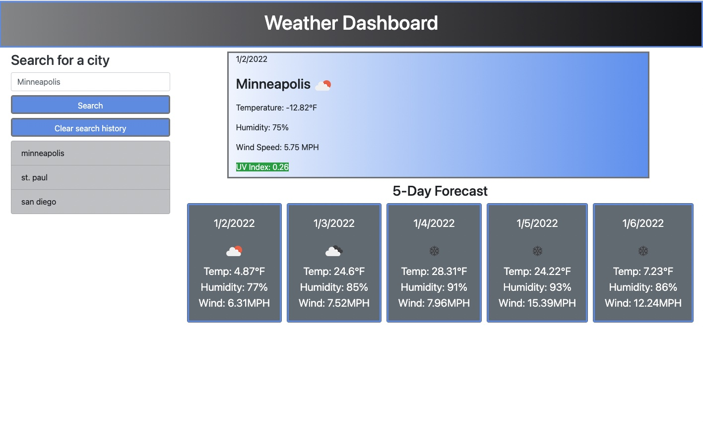

# weather-dashboard app

### It is required to accomplish a weather dashboard outlook pulling the weather details from https://openweathermap.org/ for current day in addition to five days forecast, every day in a small tag. so the traveller can plan their trips and for any other purpose.
### When the search for any city is done that city name will be saved in a side bar so going back to it would be easy.
## The work included:
### <li> Establishing the html work in the index file having the form to search for the city and assigned space to create the current and five days tags of forecast weather.
### <li> In css and javascript fils, the style and the action of the work was done.
### <li> Once the city name put in the form for search the app pulls the weather information and save the city name in search history and shows it in the cities list.
### <li> In same time it shows the current weather details on the top and under it, five days weather details in five tags.

### <li> Clicking on any city name in the cities list will show the weather details again.
### <li> If cities list history no more needed or wanted to git rid of, one click on button (delete search history) will do that.

## I use in this work:
### <li> HTML 
### <li> CSS
### <li> Javascript
  
## Bellow is a screenshot for the app

                                                       
  
### Link of the deployed work

  https://osamarli.github.io/06-weather-dashboard/
  

  
### Omar Asamarai
